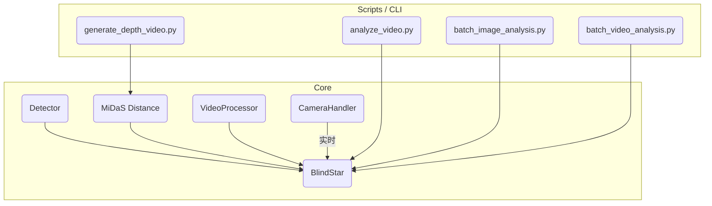

# BlindStar 项目上下文 (Context)

本文件提供对 **BlindStar** 代码库的快速全局视图，可供新成员、自动化工具或 AI Agent 在有限上下文内查阅。

---

## 1. 目标与核心思想

BlindStar 是面向视障人士的实时视觉辅助系统，结合 **YOLOv8** 目标检测与 **MiDaS** 深度估计，输出语音提示、距离信息及视频/图片可视化结果，支持离线与实时场景。

---

## 2. 顶层目录结构

```
BlindStar/
├── core/                    # 🧠 核心功能层 (纯 Python 模块，可被外部调用)
│   ├── blindstar.py         # 主控制类，整合 Detector/Distance/VideoProcessor
│   ├── detector.py          # YOLOv8 检测封装 (DetectionResult & draw_detections)
│   ├── distance.py          # MiDaS 距离测量
│   ├── video_processor.py   # 离线视频批处理 (含进度回调)
│   ├── camera.py            # 摄像头 / 视频文件帧读取 (支持线程)
│   ├── frame_analyzer.py    # 详细帧级分析器 (可选)
│   ├── speed_measurement.py # 速度估计 (选配)
│   └── utils.py             # 通用工具
│
├── tests/                  # 🎥 分析 / Demo / 回归测试脚本
│   ├── analyze_video.py         # 单视频 / 摄像头 YOLO+MiDaS 分析
│   ├── batch_image_analysis.py  # 批量图片分析 (含深度图)
│   ├── batch_video_analysis.py  # 批量视频分析
│   └── generate_depth_video.py  # 仅深度可视化 & CSV 统计
│
├── datasets/               # 训练/推理用 YOLO 格式数据 (images/, labels/)
├── models/                 # 本地缓存或自定义 `.pt` 权重
├── logs/                   # 运行时输出 (每次分析自动建子目录)
├── results/                # 可选：批处理结果汇总
│
├── config.py               # 全局配置 (ModelConfig / VideoConfig / 等)
├── requirements.txt        # Python 依赖列表
├── README.md               # 使用说明 (面向最终用户)
└── PROJECT_CONTEXT.md      # << 当前文件，供开发/AI 快速索引 >>
```

---

## 3. 核心组件关系



- **Detector**：`core/detector.py`，自动读取权重内嵌 `model.names`；若传 `--data`，则覆写。
- **BlindStar**：对外统一入口，提供 `initialize / detect_image / analyze_frame / process_video / start_camera` 等便捷方法。
- **VideoProcessor**：长视频离线分析，支持 `progress_callback` 与 100 帧日志节流。

---

## 4. 自定义模型使用

1. 训练得到权重 `runs/detect/train/weights/best.pt` (Ultralytics YOLOv8)。
2. 推理时直接当作 `yolo_model` 传入，或在脚本里用 `--weights`：

```cmd
python tests\analyze_video.py --source demo.mp4 ^
    --weights runs\detect\train\weights\best.pt ^
    --data datasets\my_data.yaml --conf 0.4
```

`YOLOv8Detector` 优先使用权重保存的 `model.names`；若同时提供 `--data`，则强制以 YAML 中 `names` 字段为准。

---

## 5. 关键运行示例

```cmd
REM 实时摄像头 (默认 yolov8s.pt，自动 GPU/CPU)
python tests\analyze_video.py --source 0

REM 批量图片分析
python tests\batch_image_analysis.py --input samples\imgs --weights yolov8n.pt

REM 仅生成深度可视化
python tests\generate_depth_video.py --source road.mp4 --model DPT_Large
```

输出示例：
```
logs/
├── road_20250730_153000/
│   ├── yolo.mp4
│   ├── depth.mp4
│   └── depth_stats.csv
└── batch_image_20250730_155500/
    ├── originals/
    ├── yolo/
    └── depth/
```

---

## 6. 日志与调试

- Ultralytics per-frame 日志已在 `detector.model(..., verbose=False)` 关闭。
- `frame_analyzer.py` 默认 `enable_detailed_log = False`；VideoProcessor 每处理 100 帧自动打印进度。
- 全局日志级别通过 `core.utils.setup_logging(level)` 或 CLI `--verbose` 切换。

---

## 7. 常见目录/文件说明

| 路径 | 说明 |
|------|------|
| `datasets/` | YOLO 格式数据集根目录 (images/, labels/, data.yaml) |
| `models/`   | 本地缓存/自定义模型权重 `.pt` |
| `logs/`     | 运行时结果：`<任务名>_<时间戳>/` |
| `config.py` | 集中调参 & 常量 |
| `requirements.txt` | Pip 依赖列表 |

---

> **提示**：AI Agent 可优先读取本文件，随后按需深入 `core/` 代码或 `tests/` 脚本。保持此文件更新可显著提升自动化协作效率。 